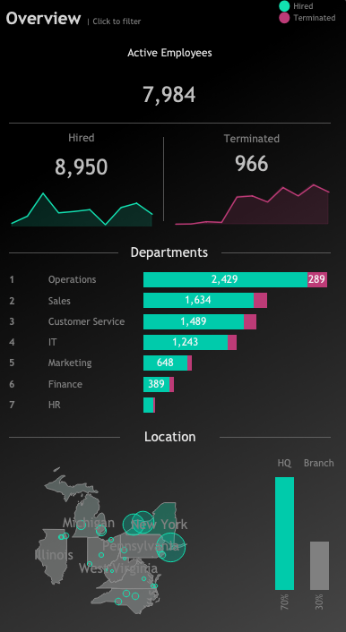

# HR Project Objectives
The objectives of the analysis are to 
- Provide summary-level views for high level insights related to employee demographics and income analysis.
- Develop a comprehensive and interactive tableau list that provides easy access to employee records information

Please click [here](https://public.tableau.com/views/HR_Dashboard_17343371058810/HRSummary?:language=en-GB&:sid=&:redirect=auth&:display_count=n&:origin=viz_share_link) to access the interactive dashboards available on my Tableau public profile.

# About the datset
The dataset was developed using ChatGPT as well as the Faker library for generating the data.

# Dashboards
Total of two dashboards **HR Details** and **HR Overview** make up the overall analysis.

## HR Overview Dashboard
The HR Overview dashboard is divided into three main segments - Overview, Demographics and Income.  

### Overview
The overview section aims to present a concise summary of key HR metrics, including employee counts categorized by various office locations, departments, and employment statuses.

- The company has successfully onboarded a total of 8,950 employees. Currently, there are 966 employees who have been terminated, leaving 7,984 active employees.
- The Operations Department reports the highest figures for both hires and terminations, whereas the HR, Marketing, and Finance departments show the lowest numbers in these categories.
- The majority of employees are based at the headquarters in New York, with the remainder distributed across branch offices.
- Additionally, the overview provides a detailed breakdown of employee numbers by city within each state.

  

### Demographics
The Demographics section offers insights into the composition of the workforce such as gender, age, education and level of performance.

Gender
- The company has a higher number of male employees compared to female employees regarding both hiring and termination, although the disparity is minimal.

Education & Age
- The predominant educational qualification among employees is a Bachelor's degree, while those with PhDs represent the smallest group. Within the Bachelor's degree holders, the majority fall within the age range of 35 to 44.

Education & Performance
- Employees with advanced degrees generally receive better performance evaluations. Conversely, those with only a high school education tend to have the lowest performance ratings, while PhD holders typically achieve the highest ratings.  

  

### Income
The income segment shows how average salary varies in terms of Education, Gender and Age.

Education & Gender
- Employees with PhD and Masters degrees have a higher average salary than those with Bachelor degrees and High School education.
- Amongst emplyoees with PhD and Master's degrees, females have a higher average salary than males.
- On the other hand, for employees with Bachelor's degree and High School education, the males have a higher average salary than females.

Age & Salary
- Managers typically enjoy salaries that exceed the average, with Finance managers leading in compensation, followed by those in IT and Sales. Regarding age demographics, individuals in these managerial roles tend to be older than the average age of 41.
- HR managers, while having the lowest average salary among managerial positions, still earn above the average threshold. Notably, the average age of HR managers is 33, which is below the overall average of 41.
- In addition to managerial roles, there are employees in non-management positions, such as System Administrators, Sales Consultants, Software Developers, and Financial Analysts, who also earn salaries that surpass the average.

  

# HR Details Dashboard
This dashboard provides a comprehensive list of all employees information such as demographics, role, salary, length of employment and employment status all in one view. This allows the HR team to quickly review high-level data relevant to the HR function. Having such a dashboard also allows HR to monitor internal staff movement more holistically by illustrating the number of new hires, exits, and internal transfers all in one central location.

